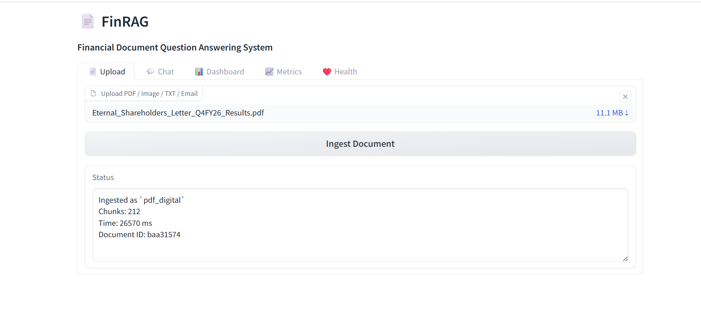
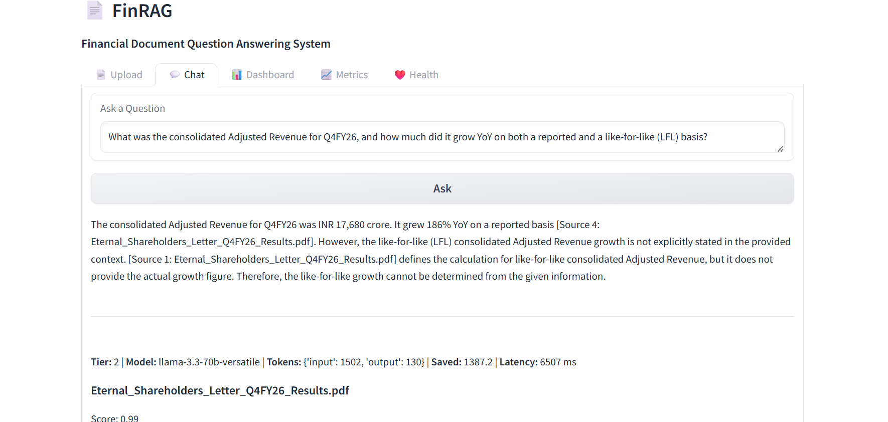
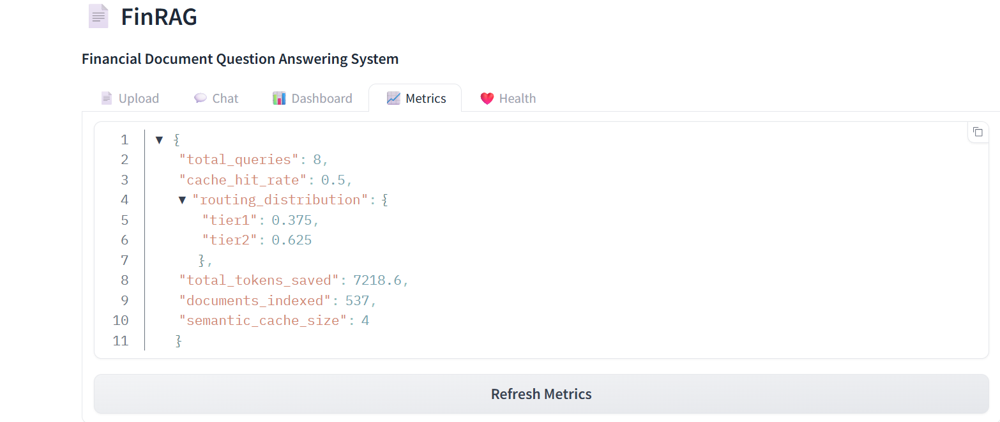
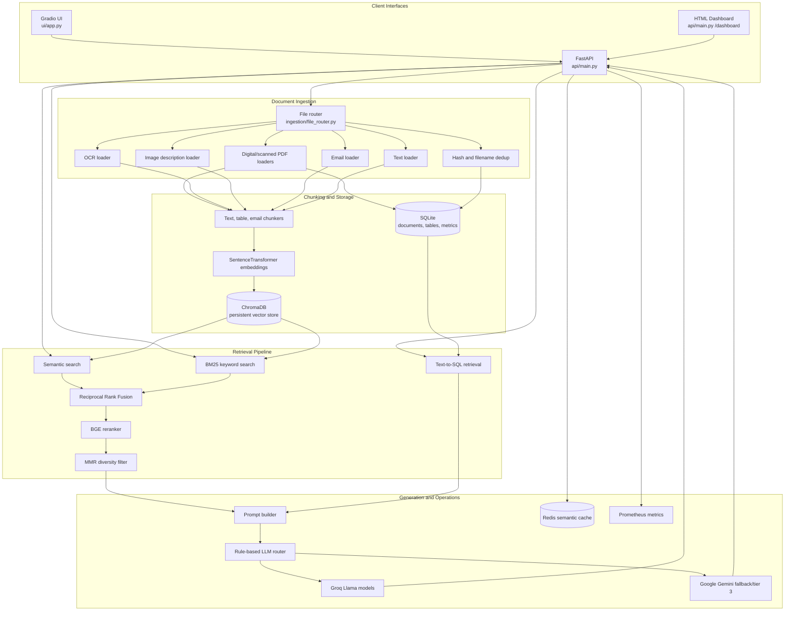

# MultiModal FinRAG Prod

A production-oriented Financial Retrieval-Augmented Generation system for ingesting financial documents, retrieving hybrid context, and routing answers across cost-aware LLM tiers.

<div align="center">

[](https://www.python.org/)
[](https://fastapi.tiangolo.com/)
[](https://www.trychroma.com/)
[](https://www.gradio.app/)
[](https://redis.io/)
[](https://prometheus.io/)

</div>

## Table of Contents

- [Project Overview](#project-overview)
- [Screenshots](#screenshots)
- [Architecture Diagram](#architecture-diagram)
- [End-to-End Pipeline](#end-to-end-pipeline)
- [System Components](#system-components)
- [Repository Structure](#repository-structure)
- [Features](#features)
- [Supported Document Types](#supported-document-types)
- [Retrieval Pipeline](#retrieval-pipeline)
- [LLM Routing Pipeline](#llm-routing-pipeline)
- [Caching Layer](#caching-layer)
- [Monitoring](#monitoring)
- [Installation](#installation)
- [Configuration](#configuration)
- [Environment Variables](#environment-variables)
- [Running Locally](#running-locally)
- [Running in Colab](#running-in-colab)
- [Running with Docker](#running-with-docker)
- [Example Usage](#example-usage)
- [Example Queries](#example-queries)
- [Sample Outputs](#sample-outputs)
- [API Endpoints](#api-endpoints)
- [Evaluation](#evaluation)
- [Benchmarks](#benchmarks)
- [Project Structure](#project-structure)
- [Future Work](#future-work)
- [License](#license)
- [Acknowledgements](#acknowledgements)

## Project Overview

MultiModal FinRAG Prod is a financial-document RAG application with a FastAPI backend, Gradio user interface, ChromaDB vector store, SQLite table store, Redis semantic cache, Prometheus metrics, and optional orchestration assets for Airflow, DVC, Grafana, and MLflow.

The system is designed around practical retrieval engineering:

- route uploaded documents by file type;
- extract text from digital PDFs, scanned PDFs, images, email, and text files;
- extract tabular data from digital PDFs into SQLite;
- chunk text, email, and table content into retrievable passages;
- combine dense vector retrieval with BM25 keyword search;
- rerank candidates with a cross-encoder;
- apply Maximum Marginal Relevance to reduce redundant context;
- route prompts to different LLM tiers based on query complexity;
- cache semantically similar answers in Redis when available;
- expose operational metrics through FastAPI and Prometheus format.

## Screenshots

Screenshots are stored under `docs/screenshots/`.

| Upload | Chat | Dashboard |
|---|---|---|
|  |  |  |

## Architecture Diagram



## End-to-End Pipeline

1. A file is uploaded through `POST /ingest` or the Gradio upload tab.
2. The file router detects whether the input is a PDF, image, email, or text file.
3. Duplicate detection uses file hashes and filenames to skip unchanged files or replace changed versions.
4. Text and table content are extracted with the relevant loader.
5. Chunks are generated for text, email, and extracted table rows.
6. Chunk embeddings are created and persisted in ChromaDB with source metadata.
7. Queries are embedded, checked against Redis semantic cache, then retrieved with hybrid search.
8. BM25 and semantic results are fused, reranked, and filtered with MMR.
9. Table-style questions also attempt Text-to-SQL against extracted SQLite tables.
10. The final prompt is routed to Groq or Gemini based on rule-based complexity classification.
11. The answer, sources, token metadata, latency, cache state, and Prometheus counters are returned.

## System Components

| Component | Purpose | Inputs | Outputs | Dependencies |
|---|---|---|---|---|
| `api/main.py` | FastAPI service and request orchestration | Uploads, queries | JSON responses, metrics, dashboard HTML | FastAPI, ChromaDB, Redis, SQLite |
| `ingestion/` | File detection and document extraction | PDFs, images, text, `.eml` files | Extracted text/tables/descriptions | pdfplumber, pdf2image, PaddleOCR, Pillow |
| `chunking/` | Converts extracted content into retrievable units | Text, tables, email fields | Chunk strings | Local chunking utilities |
| `embeddings/` | Embedding model wrapper and ChromaDB store | Chunk strings, queries | Embeddings, persisted vectors | sentence-transformers, ChromaDB |
| `retrieval/` | Semantic, keyword, SQL, reranking, and MMR retrieval | Query, vector store, SQLite tables | Ranked context chunks | rank-bm25, BGE reranker |
| `generation/` | LLM client wrappers and prompt construction | Prompt, retrieved context | Model response metadata | Groq, Google Generative AI |
| `routing/` | Query complexity classification and model tier selection | Query, prompt, image flag | Routed generation result | Groq, Gemini |
| `cache/` | Redis-backed semantic answer cache | Query embeddings, response payloads | Cache hit/miss and stored payloads | Redis, NumPy |
| `monitoring/` | Request, retrieval, cache, and token metrics | API events | Prometheus metrics and dashboard data | prometheus-client |
| `ui/` | Gradio app for uploads, chat, dashboard, metrics, health | User actions | Browser UI | Gradio, requests |

## Repository Structure

```text
finrag/
├── api/                         # FastAPI app, routes, response schemas
├── cache/                       # Redis semantic cache
├── chunking/                    # Text, table, and email chunking
├── data/                        # Runtime data: uploads, ChromaDB, SQLite
├── database/                    # SQLite table/document helpers
├── demo/                        # Existing demo screenshots
├── docs/                        # Project documentation and screenshots
├── embeddings/                  # Embedding and ChromaDB wrappers
├── experiments/                 # MLflow logging helper
├── generation/                  # Groq/Gemini clients and prompt builder
├── ingestion/                   # File routing and content extraction
├── monitoring/                  # Prometheus middleware and Grafana dashboards
├── orchestration/               # Airflow DAG definitions
├── retrieval/                   # Hybrid search, reranker, MMR, SQL retrieval
├── routing/                     # Query classifier, LLM router, token tracker
├── ui/                          # Gradio application
├── .env.example                 # Environment variable template
├── dvc.yaml                     # DVC pipeline definition
├── README_COLAB.md              # Colab run guide
├── requirements.txt             # Python dependencies
└── README.md
```

## Features

- FastAPI ingestion and query service.
- Gradio interface for upload, chat, dashboard, metrics, and health views.
- Digital PDF and scanned PDF handling.
- Image upload support through an image-description loader.
- Email and text-file ingestion.
- PDF table extraction into SQLite.
- Persistent ChromaDB vector storage.
- Hybrid retrieval with semantic search, BM25, and Reciprocal Rank Fusion.
- Cross-encoder reranking with `BAAI/bge-reranker-base`.
- Maximum Marginal Relevance context selection.
- Rule-based model routing across Groq and Gemini.
- Redis semantic cache that fails soft when Redis is unavailable.
- Prometheus-compatible metrics endpoint.
- Grafana dashboard JSON files.
- Airflow DAG definitions for scheduled ingestion/reindexing.
- DVC and MLflow support files.

## Supported Document Types

| Type | Current behavior |
|---|---|
| Digital PDF | Extracts text and tables; stores table rows in SQLite; chunks extracted content. |
| Scanned PDF | Uses OCR path and chunks extracted text. |
| Image (`.png`, `.jpg`, `.jpeg`, `.webp`) | Generates an image description and chunks the description text. |
| Email (`.eml`) | Loads email fields and chunks email content. |
| Text (`.txt`) | Loads plain text and chunks it. |
| CSV/TSV | Detected by `file_router.py`, but not currently handled by the FastAPI ingest branch. |

## Retrieval Pipeline

The retrieval path is intentionally layered:

1. `semantic_search` retrieves dense-vector neighbors from ChromaDB.
2. `bm25_search` builds a keyword index over current vector-store documents.
3. `hybrid_search` merges semantic and BM25 candidates with Reciprocal Rank Fusion.
4. `rerank` scores candidates with `BAAI/bge-reranker-base`.
5. `mmr_filter` selects a smaller, more diverse context set.
6. `sql_retrieve` optionally asks a Groq model to produce a SQLite `SELECT` query for table-oriented questions.
7. `prompt_builder` assembles retrieved chunks and optional SQL output into a generation prompt.

## LLM Routing Pipeline

`routing/complexity_classifier.py` classifies each query into one of three tiers using simple rules:

| Tier | Routing behavior |
|---|---|
| Tier 1 | Short/direct questions route to `llama-3.1-8b-instant` through Groq. |
| Tier 2 | Analytical or medium-complexity questions route to `GROQ_TIER2_MODEL`, defaulting to `llama-3.3-70b-versatile`. |
| Tier 3 | Long, synthesis-style, trend, multi-document, or image-reference questions route to Gemini. If Gemini fails, the router falls back to the Tier 2 Groq model. |

## Caching Layer

The semantic cache stores query embeddings and response payloads in Redis. On each query, the API computes cosine similarity against cached embeddings and returns a cached answer when the best match is above the configured threshold.

Redis is optional at runtime. If Redis is not available, cache checks and writes are skipped and the request continues normally.

## Monitoring

The API exposes:

- `GET /metrics` for JSON operational metrics;
- `GET /metrics/prometheus` for Prometheus scrape format;
- `GET /health` for service health and indexed document count;
- Grafana dashboard definitions under `monitoring/grafana_dashboards/`.

Tracked values include total queries, cache hits, tier distribution, request latency, retrieval latency, token savings gauge, and document ingestion count.

## Installation

```bash
git clone https://github.com/GarvGupta25/MutliModal_FinRAG_Prod.git
cd MutliModal_FinRAG_Prod

python -m venv .venv
.venv\Scripts\activate
pip install -r requirements.txt
```

On Linux or Colab, install system packages used by PDF and file-type parsing:

```bash
sudo apt-get install -y poppler-utils libmagic1 redis-server
```

## Configuration

Create a local environment file from the template:

```bash
copy .env.example .env
```

Then fill in the required keys and paths.

## Environment Variables

| Variable | Required | Purpose |
|---|---:|---|
| `GROQ_API_KEY` | Yes | Groq model access for Tier 1, Tier 2, and SQL generation. |
| `GOOGLE_API_KEY` | Yes for Tier 3 | Gemini generation for complex or image-reference queries. |
| `GROQ_TIER2_MODEL` | No | Overrides the default Tier 2 Groq model. |
| `CHROMA_PERSIST_DIR` | No | ChromaDB persistence directory. Defaults to `./data/chromadb`. |
| `SQLITE_PATH` | No | SQLite database path. Defaults to `./data/tables.db`. |
| `REDIS_URL` | No | Redis connection URL. Defaults to `redis://localhost:6379`. |

## Running Locally

Start Redis if you want semantic caching:

```bash
redis-server
```

Start the API:

```bash
uvicorn api.main:app --reload
```

Start the Gradio UI in another terminal:

```bash
python -m ui.app
```

Open:

- API docs: `http://localhost:8000/docs`
- Dashboard: `http://localhost:8000/dashboard`
- Metrics JSON: `http://localhost:8000/metrics`
- Prometheus metrics: `http://localhost:8000/metrics/prometheus`

## Running in Colab

Use the included guide:

```text
README_COLAB.md
```

The Colab flow installs system dependencies, starts Redis, configures API keys, launches the API, and exposes the Gradio interface.

## Running with Docker

Docker deployment files are not present in this repository at the time of this README. The monitoring dashboards, Airflow DAGs, DVC file, and MLflow helper are included as code assets that can be wired into a future containerized deployment.

## Example Usage

### Ingest a Document

```bash
curl -X POST "http://localhost:8000/ingest" ^
  -F "file=@C:\path\to\annual_report.pdf"
```

### Query the System

```bash
curl -X POST "http://localhost:8000/query" ^
  -H "Content-Type: application/json" ^
  -d "{\"query\":\"What was the company's revenue trend?\",\"top_k\":5}"
```

### Python Client

```python
import requests

with open("annual_report.pdf", "rb") as f:
    ingest = requests.post("http://localhost:8000/ingest", files={"file": f})
    print(ingest.json())

query = requests.post(
    "http://localhost:8000/query",
    json={"query": "Summarize the main risk factors.", "top_k": 5},
)
print(query.json()["answer"])
```

## Example Queries

- "What is the total revenue mentioned in the report?"
- "Compare revenue and operating income across the available tables."
- "Summarize the main risk factors across the uploaded documents."
- "Which document contains the liquidity discussion?"
- "Explain the year-over-year change in margins."

## Sample Outputs

`POST /ingest` returns:

```json
{
  "status": "success",
  "document_id": "a1b2c3d4",
  "chunks_created": 42,
  "processing_time_ms": 12840.5,
  "document_type": "pdf_digital",
  "dedup_action": "new"
}
```

`POST /query` returns:

```json
{
  "answer": "Generated answer text...",
  "sources": [
    {
      "source": "annual_report.pdf",
      "score": 0.84,
      "text": "Retrieved source preview..."
    }
  ],
  "model_used": "llama-3.3-70b-versatile",
  "tier": 2,
  "tokens_used": {
    "input": 1200,
    "output": 220
  },
  "tokens_saved_vs_tier3": 0.0,
  "retrieval_latency_ms": 350.2,
  "total_latency_ms": 1890.4
}
```

## API Endpoints

| Method | Endpoint | Purpose |
|---|---|---|
| `GET` | `/health` | Returns service health and indexed document count. |
| `GET` | `/dashboard` | Returns the built-in HTML dashboard. |
| `GET` | `/metrics` | Returns JSON runtime metrics. |
| `GET` | `/metrics/prometheus` | Returns Prometheus scrape-format metrics. |
| `POST` | `/ingest` | Uploads and indexes a document. |
| `POST` | `/query` | Retrieves context and generates an answer. |

## Evaluation

No formal evaluation harness is currently included. The repository contains retrieval and monitoring infrastructure, but it does not yet include a labeled evaluation dataset, retrieval metric script, regression test suite, or benchmark report.

## Benchmarks

No benchmark results are published in this repository. Latency, cache-hit rate, answer quality, and token-savings metrics should be measured on a defined corpus before being reported.

## Project Structure

The current structure separates API, ingestion, retrieval, routing, monitoring, and UI concerns clearly. Runtime artifacts such as uploaded files, local databases, Redis state, and vector-store contents should remain outside version control.

## Future Work

- Add a small public financial-document evaluation set.
- Add retrieval metrics such as recall@k, MRR, and nDCG.
- Add answer-quality evaluation with pinned prompts and deterministic test fixtures.
- Add Docker Compose for API, Redis, Prometheus, Grafana, and optional Airflow.
- Add CI checks for formatting, imports, and API smoke tests.
- Complete CSV/TSV ingestion or remove the router branch until supported.
- Add structured examples under `examples/`.

## License

This repository currently includes an MIT license file.

## Acknowledgements

This project uses open-source tools from the Python, FastAPI, ChromaDB, Sentence Transformers, Redis, Prometheus, Gradio, and broader LLM engineering communities.
